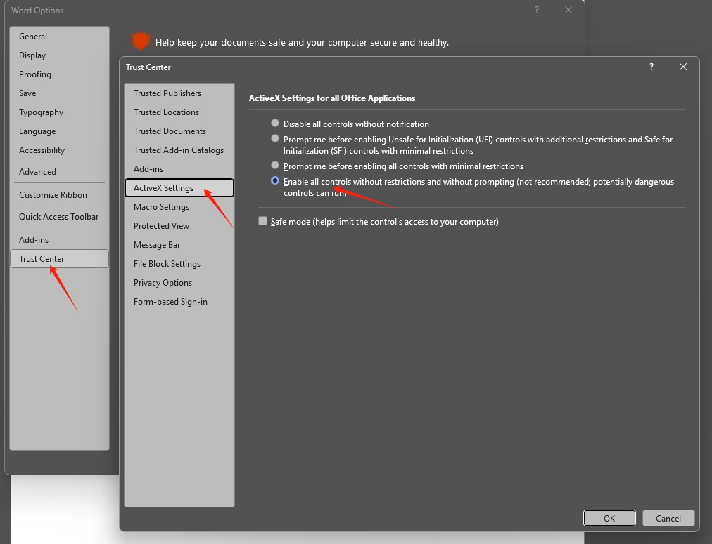
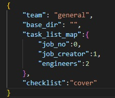

## Checklist 自动填写工具

这是一个自动化工具，用于批量处理项目的checklist.docx文件。程序会读取Excel任务列表，扫描对应的项目文件夹，并自动填写checklist文档。

## 工作流程

### 首次准备工作
   - 确保word中的trust center信任activeX控件

      

   - 用户准备签名图片文件夹 `signs`，
      - 将所有工程师或助理的签名图片放入该文件夹以名字命名，大小写与task list.xlsx中的一致即可
      - 图片大小建议320x120，不用很精确
   - 用户确保配置文件`user.json` 正确配置
      
      

      - `team` 为组别，只允许"general"和"ppt"两个选项，除了ppt组，其他组都填general
      - `base_dir`为案夹所在顶层文件夹，
         - 工具为"S:\DATA\HZ Engineer Documents\TM\project",
         - 灯具为“S:\DATA\HZ Engineer Documents\LUM”， 
         - 家电为“S:\DATA\HZ Engineer Documents\HA\Project”， 
         - ppt为“S:\DATA\HZ Engineer Documents\PPT\2025 Project shortcut”
         - **路径中所有\改为双斜杠\\\ 。**
      - `checklist`用于选择checklist文件来源，只允许“cover"和"fill"
         - "cover"含义为用程序template目录下的模板直接覆盖
         - "fill"含义为直接填写项目目录下已有的checklist
      - `task_list_map`为指定task list中三列信息的列号，<bold>第一列从0开始</bold>
   - `system.json`不要随意修改，供调试适用
### 每次使用准备工作
   - 用户自行准备 `task list.xlsx` 文件，参考程序目录下的sample，任何xlsx后缀的excel表格都可以，只要有项目号，工程师，助理三列信息即可，列号需与`user.json`的`task_list_map`中的列号对应
### 程序使用
   - 点击选择task list
   - 点击运行检查
### 完成后确认（如果需要）
   - 表格里点击打开目录或打开文件自行确认

### 自动化处理流程
   - 根据 `user.json` 中的 `task_list_map` 读取 `task list.xlsx`，获取项目信息（项目号、创建人、负责工程师）
   - 遍历每个项目，执行以下操作：
     1. 根据项目号（job_no）在 `base_dir` 中, 根据`user.json`中的`team`使用不同方式去查找对应的项目文件夹
     2. 获取`system.json`中的`subFolderConfig`的配置，
         - 根据`fields`配置填写`fields`，
         - 根据`options`配置，扫描对应文件夹内的文件情况，来填写activeX控件
     3. 保存并关闭文档
     4. 记录
   
