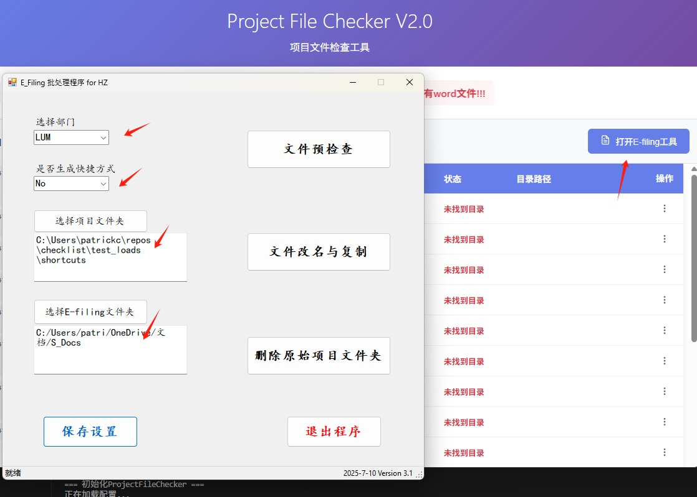

## Checklist 自动填写工具 V2.0

这是一个为E-filing工具提供自动化的便捷应用，用于批量处理项目的checklist.docx文件。程序会读取Excel任务列表，扫描对应的项目文件夹内容，并根据内容自动填写checklist文档，以供E-filing使用。

### V2.0 更新内容

- 修复了若干已知bug
- 配置改为软件内配置，无需手动修改配置文件
- 结果列表中增加了重新运行功能，用于失败的项目，调整后，重新单独运行该项目
- 增加E-filing tool的联动，并自动填充必要信息

## 工作流程

### 首次准备工作
   - 确保word中的trust center信任activeX控件

      

   - 用户准备签名图片文件夹 `signs`，
      - 将所有工程师或助理的签名图片放入该文件夹以名字命名，大小写与task list.xlsx中的一致即可
      - 图片大小建议320x120，不用很精确
   - 用户在配置中心配置几个关键信息
      
      

      

      以及其他一些配置，譬如task list的列号对应关系，e-filing工具路径

### 每次使用准备工作
   - 用户自行准备 `task list.xlsx` 文件，参考程序目录下的sample，任何xlsx后缀的excel表格都可以，只要有项目号，工程师，助理三列信息即可，列号需要与配置中心配置相一致
### 程序使用
   - 点击选择task list
   - 点击运行检查
### 完成后确认（如果需要）
   - 表格里点击打开目录或打开文件自行确认
### 运行失败的，允许重新单独运行
 

 ### 自动打开E-filing工具并填充必要信息
  

### 自动化处理流程
   - 根据 `user.json` 中的 `task_list_map` 读取 `task list.xlsx`，获取项目信息（项目号、创建人、负责工程师）
   - 遍历每个项目，执行以下操作：
     1. 根据项目号（job_no）在 `base_dir` 中, 根据`user.json`中的`team`使用不同方式去查找对应的项目文件夹
     2. 获取`system.json`中的`subFolderConfig`的配置，
         - 根据`fields`配置填写`fields`，
         - 根据`options`配置，扫描对应文件夹内的文件情况，来填写activeX控件
     3. 保存并关闭文档
     4. 记录
   
