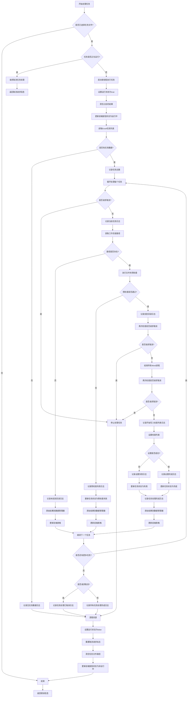
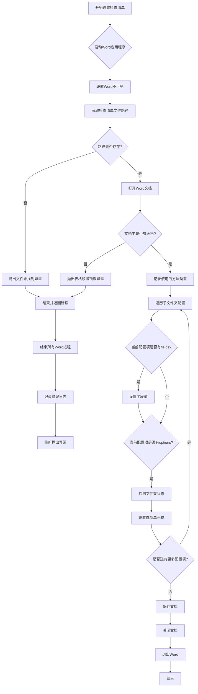

### 任务清单运行逻辑

```mermaid
flowchart TD
    A[开始处理任务] --> B{是否已选择任务文件?}
    B -->|否| C[提示选择任务文件]
    B -->|是| D{任务是否正在运行?}
    D -->|是| E[请求取消任务处理]
    D -->|否| F[启动新线程执行任务]
    
    F --> G[设置运行状态为true]
    G --> H[清空之前的结果]
    H --> I[更新前端按钮状态为运行中]
    I --> J[读取Excel任务列表]
    J --> K{是否有任务数据?}
    K -->|否| L[记录无任务数据日志]
    K -->|是| M[记录任务总数]
    
    M --> N[循环处理每个任务]
    N --> O{是否请求取消?}
    O -->|是| P[停止处理任务]
    O -->|否| Q[记录当前任务日志]
    Q --> R[获取工作目录路径]
    R --> S{路径是否存在?}
    S -->|否| T[记录未找到目录日志]
    T --> U[添加结果到数据管理器]
    U --> V[更新前端表格]
    V --> W[继续下一个任务]
    
    S -->|是| X[执行文件夹预检查]
    X --> Y{预检查是否通过?}
    Y -->|否| Z[记录预检查失败日志]
    Z --> AA[更新任务状态为预检查失败]
    AA --> AB[添加结果到数据管理器]
    AB --> AC[更新前端表格]
    AC --> W
    
    Y -->|是| AD[记录找到目录日志]
    AD --> AE[再次检查是否请求取消]
    AE --> AF{是否请求取消?}
    AF -->|是| P
    AF -->|否| AG[结束所有Word进程]
    AG --> AH[再次检查是否请求取消]
    AH --> AI{是否请求取消?}
    AI -->|是| P
    AI -->|否| AJ[记录开始写入检查列表日志]
    AJ --> AK[设置检查列表]
    AK --> AL{设置是否成功?}
    AL -->|否| AM[记录设置失败日志]
    AL -->|是| AN[记录设置完成日志]
    AM --> AO[更新任务状态为失败]
    AN --> AP[更新任务状态为完成]
    AO --> AQ[记录任务处理完成日志]
    AP --> AQ
    AQ --> AR[添加结果到数据管理器]
    AR --> AS[更新前端表格]
    AS --> W
    
    W --> AT{是否还有更多任务?}
    AT -->|是| N
    AT -->|否| AU{是否请求取消?}
    AU -->|是| AV[记录任务处理已取消日志]
    AU -->|否| AW[记录所有任务处理完成日志]
    
    AV --> AX[清理资源]
    AW --> AX
    AX --> AY[设置运行状态为false]
    AY --> AZ[重置取消请求标志]
    AZ --> BA[清空任务文件路径]
    BA --> BB[更新前端按钮状态为非运行中]
    BB --> C[结束]
    
    C --> C1[返回错误信息]
    E --> E1[返回取消请求信息]
    L --> AX
    P --> AX

```

### set checklist 逻辑

```mermaid
flowchart TD
    A[开始设置检查清单] --> B{启动Word应用程序}
    B --> C[设置Word不可见]
    C --> D[获取检查清单文件路径]
    D --> E{路径是否存在?}
    E -->|否| F[抛出文件未找到异常]
    E -->|是| G[打开Word文档]
    G --> H{文档中是否有表格?}
    H -->|否| I[抛出表格设置错误异常]
    H -->|是| J[记录使用的方法类型]
    
    J --> K[遍历子文件夹配置]
    K --> L{当前配置项是否有fields?}
    L -->|是| M[设置字段值]
    M --> N{当前配置项是否有options?}
    L -->|否| N
    
    N -->|是| O[检测文件夹状态]
    O --> P[设置选项单元格]
    P --> Q{是否还有更多配置项?}
    Q -->|是| K
    Q -->|否| R[保存文档]
    
    R --> S[关闭文档]
    S --> T[退出Word]
    T --> U[结束]
    
    F --> V[结束并返回错误]
    I --> V
    V --> W[结束所有Word进程]
    W --> X[记录错误日志]
    X --> Y[重新抛出异常]
```
